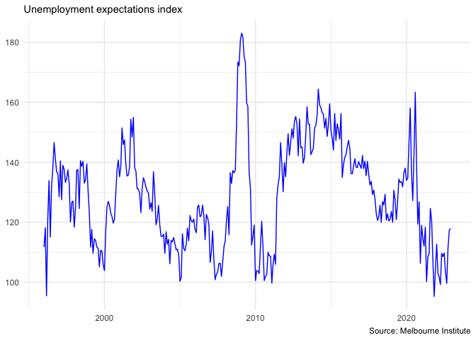

<!-- README.md is generated from README.Rmd. Please edit that file -->

# readmits

<!-- badges: start -->

[](https://lifecycle.r-lib.org/articles/stages.html#experimental)
<!-- badges: end -->

`readmits` makes it possible to download and import data from the
Melbourne Institute Time Series collection. Note that access to this
collection is not free, and a username and password is required.

## Installation

You can install the development version of readmits from
[GitHub](https://github.com/) with:

``` r
# install.packages("remotes")
remotes::install_github("MattCowgill/readmits", dependencies = TRUE)
```

Note that `readmits` currently requies that the [Firefox
browser](https://www.mozilla.org/en-US/firefox/new/) is installed on
your system.

## Example

With `read_mits()`, we can download the Wages Growth and Unemployment
Expectations tables from the Melbourne Institute collection. **Note that
only these two tables are currently supported. Contributions to this
package are welcome.**

``` r
library(readmits)

mits_data <- read_mits()

mits_data
#> # A tibble: 13,559 × 4
#>    date       series                          value table                    
#>    <date>     <chr>                           <dbl> <chr>                    
#>  1 1996-01-01 Unemployment Expectations Index 112.  Unemployment expectations
#>  2 1996-01-01 Age 18-24                        98.1 Unemployment expectations
#>  3 1996-01-01 Age 25-44                       113.  Unemployment expectations
#>  4 1996-01-01 Age over 45                     115.  Unemployment expectations
#>  5 1996-01-01 Tenant                          112.  Unemployment expectations
#>  6 1996-01-01 Mortgagee                       109.  Unemployment expectations
#>  7 1996-01-01 Owned                           113.  Unemployment expectations
#>  8 1996-01-01 Managers/Professionals          110.  Unemployment expectations
#>  9 1996-01-01 Technicians/Service workers     109.  Unemployment expectations
#> 10 1996-01-01 Administrative/Sales workers    110.  Unemployment expectations
#> # … with 13,549 more rows
```

Because `read_mits()` returns a tidy tibble, it’s straightforward to
visualise the results. For example:



## Lifecycle

This package is **experimental**. I do not expect to submit it to CRAN.
I made it primarily for my own use, but am making it available for
anyone else who may find it useful. Bear in mind that changes to the
Melbourne Institute Subscriber Services website could render this
package inoperable.
